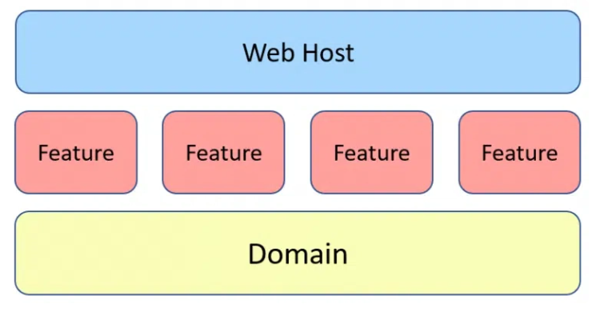

# Pickimage

## Run tasks

To run the dev server for your app, use:

```sh
npm run serve
```

To create a production bundle:

```sh
npm run build
```

To run the test for your app, use:

```sh
npm run test
```

To see all available targets to run for a project, run:

```sh
npm run graph
```
## Architecture




## Features

- Responsive
- Dark Theme
- Infinite Scroll Search
- Keep last image search on reload
- Load last image detail on reload
- [Testing with fluent builder pattern](./libs/repositories/src/lib/unsplash/unsplash.repository.spec.ts)